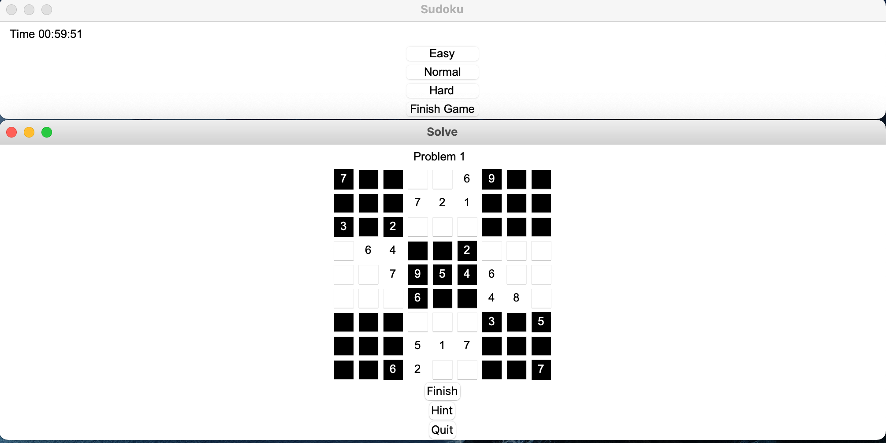

# Python Sudoku Game

## Table of Content
- [Introduction](#introduction)
- [Usage](#usage)
- [Screenshot](#screenshot)

## Introduction
Sudoku Game written in Python3.  
In this game, there are 3 level of problems
- Easy (5 problems)
- Normal (5 problems)
- Hard (5 problems)

## Usage

```bash
python3 -m main

```
## Screenshot


